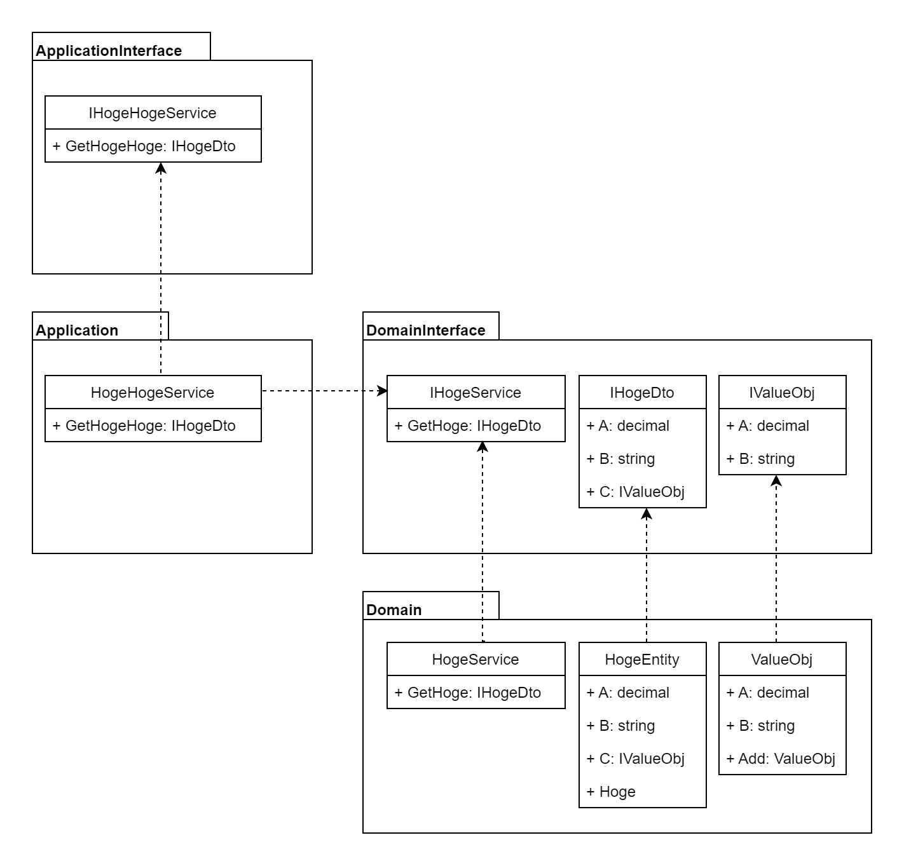

# 依存性反転の原則
## Stairwayパターン

### ポイント
- 各具象クラスを持つプロジェクトは抽象クラスを持つプロジェクトを参照する。  
これにより、各具象クラスの変更が、他のクラスに影響を与えなくなる。
- 抽象メソッドのInput/OutPutで使用するDTOに該当するインターフェースを用意する。  
例えばHogeDtoを集約のEntityとして扱っていたとしても、集約の機能自体がApplicationに漏れることはなくなる。  
DTOとしてしか扱わない層では、具象クラスを作成する必要もなくなる。  
- Domai層で定義した値オブジェクトやEnum値を型として使用できない  
Iterface側に具象クラスを定義することはしたくないのでやらない。  
ただし値オブジェクトに関しては、値オブジェクトを構成するプロパティを定義したインターフェイスを用意することで、必要な情報をInput/OutPutに乗せることは可能である。  
